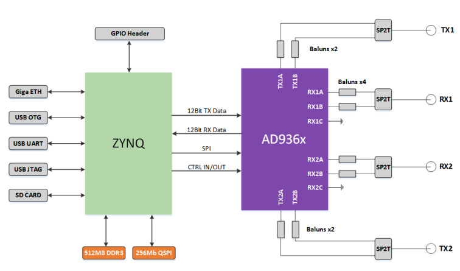

# antsdr-fw
[ANTSDR Firmware](https://github.com/MicroPhase/antsdr-fw) for the [ANTSDR](https://item.taobao.com/item.htm?spm=a230r.1.14.16.34e21142YIlxqx&id=647986963313&ns=1&abbucket=2#detail) .
This project is forked from ADI [ADALM-PLUTO ](https://github.com/analogdevicesinc/plutosdr-fw) 


## Update Info
For now, here is a new hardware releases of ANTSDR, the hardware version will be named as **ANTSDR E310**, the older version of **ANTSDR B220** will not be spported any more. For the ANTSDR B220 user, follow the **Build Instructions** to build The corresponding firmware.

## ANTSDR Schematic
The ANTSDR E310 schematic is in the [schematic folder](./schematic),  you can find the hardware design here.

## Build Instructions
The ANTSDR Firmware is built with the [Xilinx Vivado 2019.1](https://www.xilinx.com/member/forms/download/xef-vivado.html?filename=Xilinx_Vivado_SDK_Web_2019.1_0524_1430_Lin64.bin). You need to install the correct Vivado Version in your linux PC, and then, you can follow the instructions below to generate the firmware for [ANTSDR E310](https://item.taobao.com/item.htm?spm=a230r.1.14.16.34e21142YIlxqx&id=647986963313&ns=1&abbucket=2#detail) or ANTSDR B220.

### building ANTSDR E310 firmware
```bash
sudo apt-get install git build-essential fakeroot libncurses5-dev libssl-dev ccache 
sudo apt-get install dfu-util u-boot-tools device-tree-compiler libssl1.0-dev mtools
sudo apt-get install bc python cpio zip unzip rsync file wget 
git clone --recursive https://github.com/MicroPhase/antsdr-fw.git 
cd ansdr-fw 
export CROSS_COMPILE=arm-linux-gnueabihf- 
export PATH=$PATH:/opt/Xilinx/SDK/2019.1/gnu/aarch32/lin/gcc-arm-linux-gnueabi/bin 
export VIVADO_SETTINGS=/opt/Xilinx/Vivado/2019.1/settings64.sh
make
```

### building ANTSDR B220 firmware
```bash
sudo apt-get install git build-essential fakeroot libncurses5-dev libssl-dev ccache 
sudo apt-get install dfu-util u-boot-tools device-tree-compiler libssl1.0-dev mtools
sudo apt-get install bc python cpio zip unzip rsync file wget 
git clone --recursive https://github.com/MicroPhase/antsdr-fw.git 
cd ansdr-fw 
git checkout b220_v1.0
export CROSS_COMPILE=arm-linux-gnueabihf- 
export PATH=$PATH:/opt/Xilinx/SDK/2019.1/gnu/aarch32/lin/gcc-arm-linux-gnueabi/bin 
export VIVADO_SETTINGS=/opt/Xilinx/Vivado/2019.1/settings64.sh
make
```

## Build Artifacts 
After the firmware building finished, you will see below file in the build folder. These files are used for flash updating.
```bash 
wcc@wcc-dev:~/wcc/ansdr-fw$ ls -AGhl build 
总用量 315M
-rw-rw-r-- 1 wcc  12M 7月   8 09:32 ant.dfu
-rw-rw-r-- 1 wcc  12M 7月   8 09:36 ant.frm
-rw-rw-r-- 1 wcc   33 7月   8 09:36 ant.frm.md5
-rw-rw-r-- 1 wcc  12M 7月   8 09:32 ant.itb
-rw-rw-r-- 1 wcc  20M 7月   8 09:36 antsdr-fw-v0.33-21-gd72e-dirty.zip
-rw-rw-r-- 1 wcc 677K 7月   8 09:36 antsdr-jtag-bootstrap-v0.33-21-gd72e-dirty.zip
-rw-rw-r-- 1 wcc   69 7月   8 09:36 boot.bif
-rw-rw-r-- 1 wcc 508K 7月   8 09:36 boot.bin
-rw-rw-r-- 1 wcc 508K 7月   8 09:36 boot.dfu
-rw-rw-r-- 1 wcc 637K 7月   8 09:36 boot.frm
-rw-rw-r-- 1 wcc 242M 7月   8 09:37 legal-info-v0.33-21-gd72e-dirty.tar.gz
-rw-rw-r-- 1 wcc 527K 7月   8 09:27 LICENSE.html
-rw-rw-r-- 1 wcc 535K 7月   8 09:29 ps7_init.c
-rw-rw-r-- 1 wcc 534K 7月   8 09:29 ps7_init_gpl.c
-rw-rw-r-- 1 wcc 4.2K 7月   8 09:29 ps7_init_gpl.h
-rw-rw-r-- 1 wcc 4.8K 7月   8 09:29 ps7_init.h
-rw-rw-r-- 1 wcc 2.8M 7月   8 09:29 ps7_init.html
-rw-rw-r-- 1 wcc  36K 7月   8 09:29 ps7_init.tcl
-rw-r--r-- 1 wcc 5.4M 7月   8 09:29 rootfs.cpio.gz
drwxrwxr-x 6 wcc 4.0K 7月   8 09:31 sdk
-rw-rw-r-- 1 wcc 2.2M 7月   8 09:32 system_top.bit
-rw-rw-r-- 1 wcc 591K 7月   8 09:29 system_top.hdf
-rwxrwxr-x 1 wcc 471K 7月   8 09:36 u-boot.elf
-rw-rw---- 1 wcc 128K 7月   8 09:36 uboot-env.bin
-rw-rw---- 1 wcc 129K 7月   8 09:36 uboot-env.dfu
-rw-rw-r-- 1 wcc 6.9K 7月   8 09:36 uboot-env.txt
-rwxrwxr-x 1 wcc 3.9M 7月   8 09:24 zImage
-rw-rw-r-- 1 wcc  17K 7月   8 09:29 zynq-ant-sdr.dtb
-rw-rw-r-- 1 wcc  17K 7月   8 09:29 zynq-ant-sdr-revb.dtb
-rw-rw-r-- 1 wcc  17K 7月   8 09:29 zynq-ant-sdr-revc.dtb
```

## Make SD card boot image
After the firmware building finished, you can build the SD card boot image for [ANTSDR](https://item.taobao.com/item.htm?spm=a230r.1.14.16.34e21142YIlxqx&id=647986963313&ns=1&abbucket=2#detail). Just type the following command.
```bash
make sdimg
```
You will see the SD boot image in the build_sdimg folder. You can just copy all these files in that folder into a SD card, plug the SD card into the ANTSDR, set the jumper into SD card boot mode.

## Update Flash by DFU
The ANTSDR also support flash boot mode. You can update the flash by DFU. Set the jumper into Flash Boot mode. When ANTSDR is power up, push the DFU button, and then, you will see the both led in the ANTSDR will turn green, now it's time to update the flash.
You should change into the build folder first,and plug a micro USB into the OTG interface. After that, you should run the following command.
```bash
sudo dfu-util -a firmware.dfu -D ./ant.dfu
sudo dfu-util -a boot.dfu -D ./boot.dfu
sudo dfu-util -a uboot-env.dfu -D ./uboot-env.dfu
sudo dfu-util -a uboot-extra-env.dfu -U ./uboot-extra-env.dfu
```
Now you can repower ANTSDR. 

Have FUN!!!
