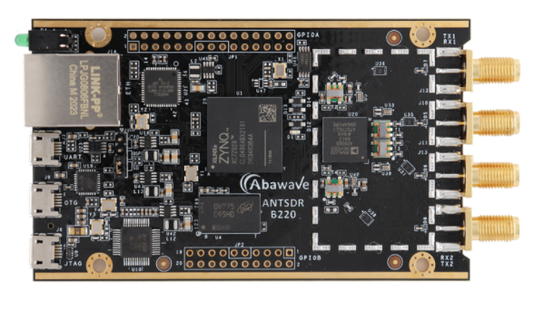

# antsdr-fw
[ANTSDR Firmware](https://github.com/MicroPhase/antsdr-fw) for the [ANTSDR](https://item.taobao.com/item.htm?spm=a230r.1.14.16.34e21142YIlxqx&id=647986963313&ns=1&abbucket=2#detail) .
This project is a fork of ADI  [ADALM-PLUTO ](https://github.com/analogdevicesinc/plutosdr-fw)


## Build Instructions

The ANTSDR Firmware is built with the [Xilinx Vivado 2019.1](https://www.xilinx.com/member/forms/download/xef-vivado.html?filename=Xilinx_Vivado_SDK_Web_2019.1_0524_1430_Lin64.bin). You need to install the correct Vivado  Version in your linux PC,  and then, you can  follow the instructions below to generate the firmware for [ANTSDR B220](https://item.taobao.com/item.htm?spm=a230r.1.14.16.34e21142YIlxqx&id=647986963313&ns=1&abbucket=2#detail).
```bash
 sudo apt-get install git build-essential fakeroot libncurses5-dev libssl-dev ccache
 sudo apt-get install dfu-util u-boot-tools device-tree-compiler libssl1.0-dev mtools
 sudo apt-get install bc python cpio zip unzip rsync file wget
 git clone --recursive https://github.com/MicroPhase/antsdr-fw.git
 cd ansdr-fw
 export CROSS_COMPILE=arm-linux-gnueabihf-
 export PATH=$PATH:/opt/Xilinx/SDK/2019.1/gnu/aarch32/lin/gcc-arm-linux-gnueabi/bin
 export VIVADO_SETTINGS=/opt/Xilinx/Vivado/2019.1/settings64.sh
 make

```
## Build Artifacts
 ```bash
      michael@HAL9000:~/devel/ansdr-fw$ ls -AGhl build
      total 372M
      -rw-rw-r-- 1 michael   69 Apr 14 11:01 boot.bif
      -rw-rw-r-- 1 michael 459K Apr 14 11:01 boot.bin
      -rw-rw-r-- 1 michael 459K Apr 14 11:01 boot.dfu
      -rw-rw-r-- 1 michael 588K Apr 14 11:01 boot.frm
      -rw-rw-r-- 1 michael 254M Apr 14 11:01 legal-info-v0.33.tar.gz
      -rw-rw-r-- 1 michael 527K Apr 14 11:03 LICENSE.html
      -rw-rw-r-- 1 michael  11M Apr 14 11:01 ant.dfu
      -rw-rw-r-- 1 michael  11M Apr 14 11:01 ant.frm
      -rw-rw-r-- 1 michael   33 Apr 14 11:01 ant.frm.md5
      -rw-rw-r-- 1 michael  11M Apr 14 11:01 ant.itb
      -rw-rw-r-- 1 michael  20M Apr 14 11:01 antsdr-fw-v0.33.zip
      -rw-rw-r-- 1 michael 571K Apr 14 11:01 antsdr-jtag-bootstrap-v0.33.zip
      -rw-rw-r-- 1 michael 442K Apr 14 11:00 ps7_init.c
      -rw-rw-r-- 1 michael 442K Apr 14 11:00 ps7_init_gpl.c
      -rw-rw-r-- 1 michael 4,2K Apr 14 11:00 ps7_init_gpl.h
      -rw-rw-r-- 1 michael 4,8K Apr 14 11:00 ps7_init.h
      -rw-rw-r-- 1 michael 2,4M Apr 14 11:00 ps7_init.html
      -rw-rw-r-- 1 michael  31K Apr 14 11:00 ps7_init.tcl
      -rw-r--r-- 1 michael 5,4M Apr 14 11:00 rootfs.cpio.gz
      drwxrwxr-x 6 michael 4,0K Apr 14 11:01 sdk
      -rw-rw-r-- 1 michael  52M Apr 14 11:03 sysroot-v0.33.tar.gz
      -rw-rw-r-- 1 michael 943K Apr 14 11:01 system_top.bit
      -rw-rw-r-- 1 michael 476K Apr 14 11:00 system_top.hdf
      -rwxrwxr-x 1 michael 438K Apr 14 11:01 u-boot.elf
      -rw-rw---- 1 michael 128K Apr 14 11:01 uboot-env.bin
      -rw-rw---- 1 michael 129K Apr 14 11:01 uboot-env.dfu
      -rw-rw-r-- 1 michael 6,5K Apr 14 11:01 uboot-env.txt
      -rwxrwxr-x 1 michael 3,9M Apr 14 10:59 zImage
      -rw-rw-r-- 1 michael  19K Apr 14 11:00 zynq-ant-sdr.dtb
      -rw-rw-r-- 1 michael  19K Apr 14 11:00 zynq-ant-sdr-revb.dtb
      -rw-rw-r-- 1 michael  19K Apr 14 11:00 zynq-ant-sdr-revc.dtb
 ```

